**GIFT fMRI Example Data (Resting State)**
### Table of Contents
1. [Introduction](#secIntro)
2. [Data](#secData)
3. [Preprocessing the demo data](#secProcDemo)
4. [Running GIFT](#secGift)
5. [Groups differences with MANCOVAN](#secMancovan)
6. [Conclusion](#secConc)
7. [References](#secRef)

# **Introduction** <a name="secIntro"></a>


## Demonstration data for GIFT

Notice Oct 14, 2022: This demo dataset that may be published in November, 2022 does still not exist as it is a work in progress. If you have any questions please email ceierud@gsu.edu.

GIFT is a handy and efficient tool that performs customizable group independent component analysis (GICA) on a study cohort. In this tutorial, we walk you through a typical GIFT analysis explaining the pipeline and its parts. We demonstrate how to use the pipeline on a cohort of 15 males and 15 females from an undisclosed study.


## Different Aspects In Data Processing 

This pipeline processes raw data to the end product, including preprocessing using fmriprep. GICA postprocessing is performed afterwards. This group ICA is guided by Neuromark, a brain atlas derived from a big cohort of fMRI scans, as described in [Du et al. 20201](https://www.sciencedirect.com/science/article/pii/S2213158220302126). Finally one may postprocess the ICA using MANCOVAN or Dynamic Functional Connectivity step. It calculates connectivity between different brain regions and highlights differences between two groups (healthy controls versus patients).


## Data Not For Research (Disclaimer) 

This data is partitioned to show results with few subjects and is biased and may not be used for research.


# **Data** <a name="secData"></a>


## Raw Data

Raw fMRI and structural T1 data is available if you have time to run demo from scratch. Please contact the authors.

Preprocessed Data

To speed up your computer processing, we have a dataset that has processed the time consuming fMRIprep steps that are not ICA focused.


# **Processing The Demo Data** <a name="secProcDemo"></a>

## `bidsify_neuromark_raw.sh` - Format Dataset According to BIDS

BIDS is a guideline providing a tidy and reproducible way to work with neuroimaging dataset. This script adds a dataset description, participants list and formats the names according to the specification. The BIDS dataset will be used in the downstream applications.

## `run-fmriprep.sh` - Preprocessing the Raw Data 

Data preprocessing includes alignment with the MNI space and different other standartization/artifact removal procedures. We use fMRIprep (Esteban et al., 2019)<sup><a href="#bookmark=id.x3n4vrij65zt">2</a></sup> for data preprocessing. It is possible to run this tool on cluster using e.g. Singularity (or Docker):


```
$ singularity run --cleanenv fmriprep.simg 
    path/to/data/dir path/to/output/dir 
    participant 
    --participant-label label
```


Please refer to [fMRIprep documentation3](https://fmriprep.org/en/1.5.1/index.html) for further information on preprocessing steps and methods. Furthermore, we attach our fMRIprep run script to the present repository under run-fmriprep.sh.

## `smooth_fmriprep_results.sh` and `smooth_subjects.sh` - Smooth the fMRIprep output
For a better ICA reconstruction in GIFT, we smooth the data using a Gaussian kernel. The core functionality is provided by `smooth_subjects.sh`:


```
fslmaths /out/fmriprep/sub-01/func/sub-01_task-mixedgamblestask_run-*1_space-MNI152NLin2009cAsym_desc-preproc_bold.nii.gz  #input file
-kernel gauss 4.2466452  #smoothing kernel details
-fmean #mean type 
/out/fmriprep/sub-01/func/sub-01_task-mixedgamblestask_run-1_space-MNI152NLin2009cAsym_desc-preproc_bold10sm.nii.gz #output path
```
To run `fslmaths`, I start the fmriprep container in `smooth_fmriprep_results.sh` and execute `smooth_subjects.sh` in this container.

This command utilizes fslmaths utility from Freesurfer (available in fmriprep too). Of course, you are welcome to use a different smoothing tool to achieve the same end.

# Running GIFT <a name="secGift"></a>

Now, that the data has been preprocessed, we turn to GIFT to actually carry out the Independent component analysis. GIFT is available in several flavors: as a Docker app, Matlab app with a graphical user interface. In following paragraphs, we look closer at all of the different ways to run GIFT.


## `run-all-gift-neuromark.sh` - Processing Independent Component Analysis Using GIFT-BIDS-App

GIFT-BIDS is available as a Docker container from Docker hub. The flavor of GIFT-BIDS, which we refer to as “regular GIFT”, is available as MATLAB GUI application. 

Please find the source code and Docker link for GIFT-BIDS at [trendscenter/gift-bids (github.com)](https://github.com/trendscenter/gift-bids). You are welcome to report bugs and suggest changes. This repository also includes a small demo on GIFT-BIDS.

GIFT-BIDS does **not **require you to have a MATLAB license.

We launch GIFT-BIDS with the command of the following form: 


```
singularity run --bind <root>/tmp1:/tmp --bind &lt;root>/tmp2:/var/tmp  #bind tmp directories 
--bind <root>/ZN_Neuromark_BIDS:/data  #input data BIDS-formatted directory 
--bind <root>/<output directory>:/output  #output directory 
--bind <root>/cfg:/cfg  #directory with the run configuration, explained below 
<root>/trends_gift-bids.img #singularity GIFT-BIDS container 
/data /output  #pointer to the mounted directories which should be used as in- and output 
participant --participant_label 004 033 111 201  #list of participant IDs to process  
--config /cfg/config_spatial_ica_bids.m  #GIFT run config  
1><log-file> 2>&1  #reroute err and std output to log-file
```


where `<root>` is a path to a root directory. Here, we mount the directories from our system into the Singularity container of GIFT. 

In this command we use Singularity, an alternative virtualization engine to Docker. Docker images and Singularity images are mutually convertible. One can e.g. use docker2singularity for image conversion. Both Docker and Singularity utilize very similar concepts - please consult the respective documentation for more information.

We bind the temporary directories tmp1 and tmp2 as they are required for temporary GIFT files during the run. Furthermore, please note that the input directory _is required to_ have BIDS formatted data. Also, subjects should have IDs of form sub-001, sub-002, sub-003 and so on. This is because GIFT currently outputs subject results in this ID format.

If you have a different form of subject IDs (say, the first is “M87395841”), you put this ID in participants.tsv stating the new subject_id as “sub-XXX”. Later on, you could look the old id in this table. You can consult our way of doing this in bidsify_neuromark_raw.sh script in this directory. If you don't do so, you could have a hard time matching subject IDs as output by GIFT with your original ones later in the analysis.

Another core part of the analysis is the run configuration.


## GIFT run configuration 

While MATLAB GUI version of GIFT allows to configure the run in the GUI directly, GIFT-BIDS utilizes a pre-written *_config.m file to choose the run mode.

Config file contents are simple “key=value” pairs written in MATLAB. For example, here is an excerpt of config_spatial_ica_bids.m we use in this demo:

```
%% Modality. Options are fMRI and EEG 
modalityType = 'fMRI'; 

%% Data Pre-processing options 
% 1 - Remove mean per time point 
% 2 - Remove mean per voxel 
% 3 - Intensity normalization 
% 4 - Variance normalization
preproc_type = 1; 

%% 'Which ICA Algorithm Do You Want To Use'; 
% see icatb_icaAlgorithm for details or type icatb_icaAlgorithm at the 
% command prompt. 
% Note: Use only one subject and one session for Semi-blind ICA. Also specify atmost two reference function names 
 
% 1 means infomax, 2 means fastICA, etc. 
algoType = 'moo-icar';
```

This signifies the basic information GIFT-BIDS needs to run, as well as choices like ICA algorithm.

To find out more parameter possibilities, check out the configuration file examples under [https://github.com/trendscenter/gift/tree/master/GroupICATv4.0c/icatb/icatb_batch_files](https://github.com/trendscenter/gift/tree/master/GroupICATv4.0c/icatb/icatb_batch_files).

# Groups difference with MANCOVAN <a name="secMancovan"></a>

To finally find the differences between the groups visualize them, we will run MANCOVAN. MANCOVAN
is a toolbox developed in adjacence to GIFT. It allows to compare individual ICs and subjects using statistical tests.

To launch MANCOVAN, select it from the main GIFT toolbox menu: 

The main window appears. 
We need to create design matrix first. Click on the corresponding box. The window will prompt you a parameter file.
It is located in the output directory of the GIFT analysis. 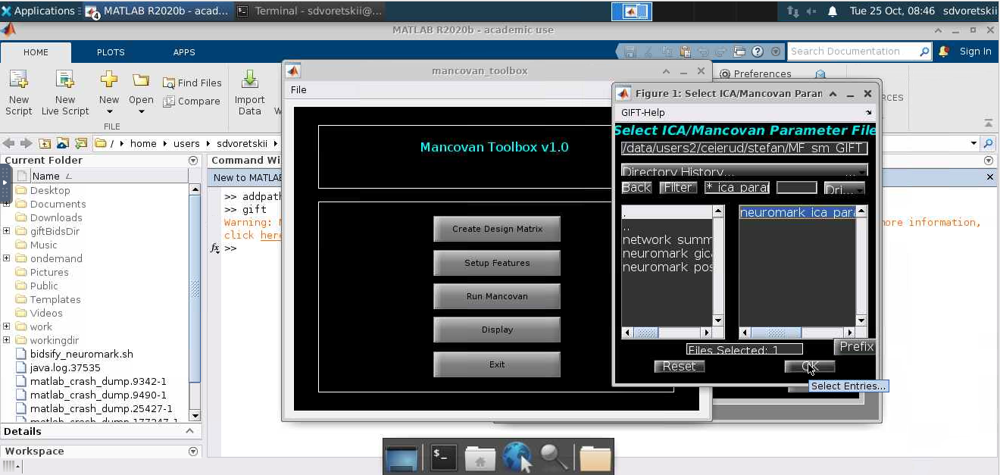

In the next step, choose a MANCOVAN output directory. Press "." to chose the directory in the left selecting pane and press "OK" in the bottom to confirm.

Next, the test configuration window appears. We will be using a "2-sample t-test" with no covariates. <a name="image3"></a>
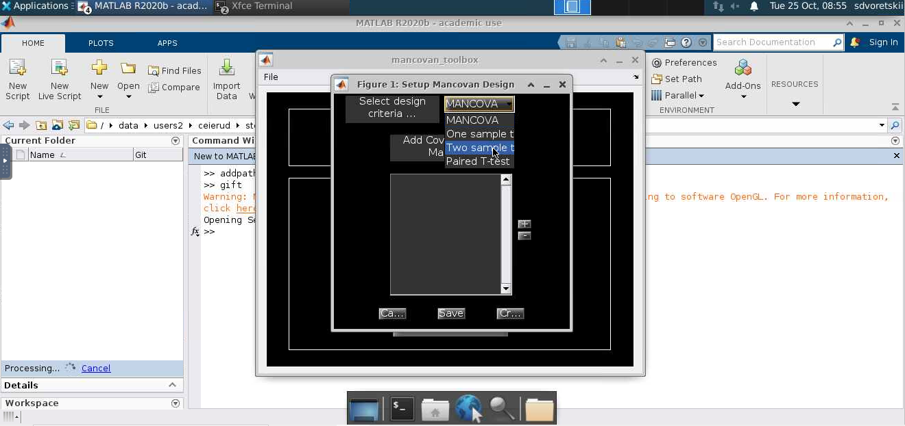

In the screen that appears, define groups. Give a name to a group, and hold "CTRL" to select multiple subjects.
Click "OK" when all the subjects of a group have been highlighted. 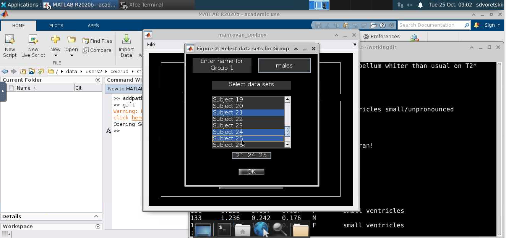

Now, define the second groups. Same rules as for the first apply. 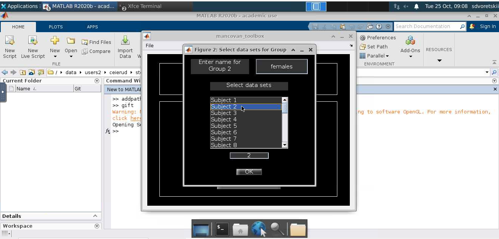

Click "OK". Return to the "Setup MANCOVAN Design" window ([as shown above](#image3)). Click "Create..." in the bottom of the window.
It gets us back to the main menu. The design matrix is set up. It is time to set up features. 
Click on the corresponding button. 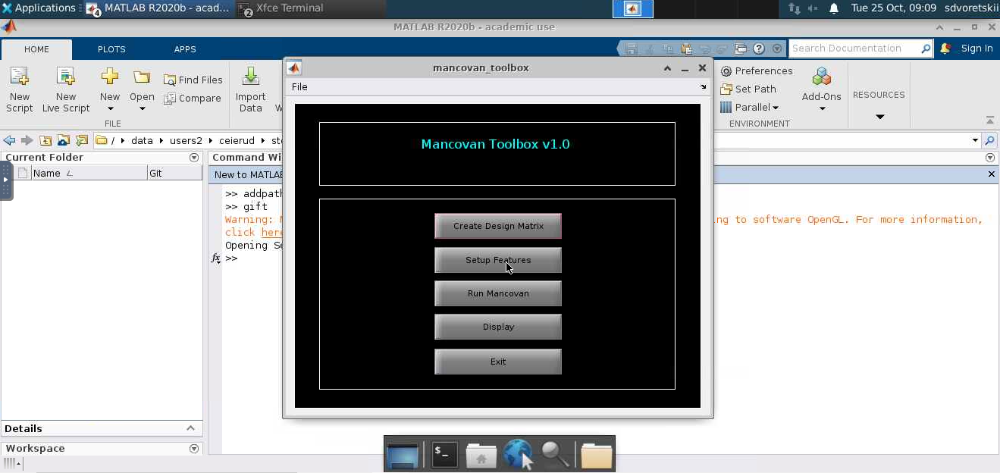
A prompt to select mancovan setup file appears. It is located in the output directory 
you have appointed in the previous steps. 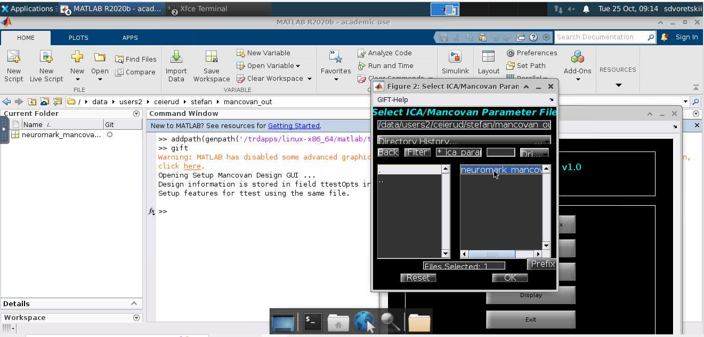

After selecting the parameter file, MANCOVAN Setup Analysis appears. 
We will be using FNC correlation without lags. 
Components are the meaningful groupings of ICs used during analysis. In our case they are dictated by the Neuromark template
 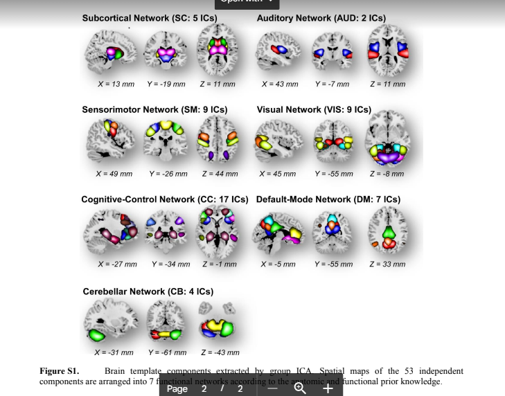

Select multiple indices (hold CTRL to select multiple manually, or SHIFT to select a range) and press "S..." in the bottom.
A functional image of selected components appears. 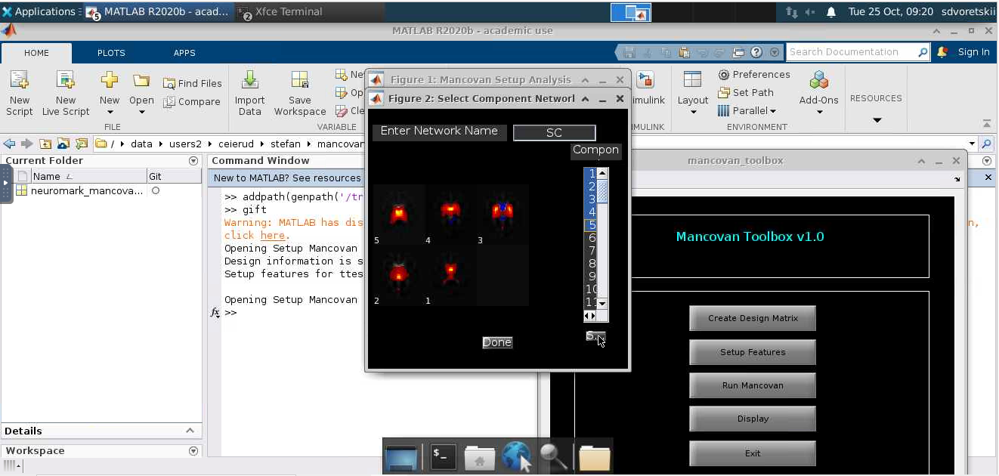

Press "Done" to confirm. The defined component is now enlisted. Repeat for all the components you wish to define.
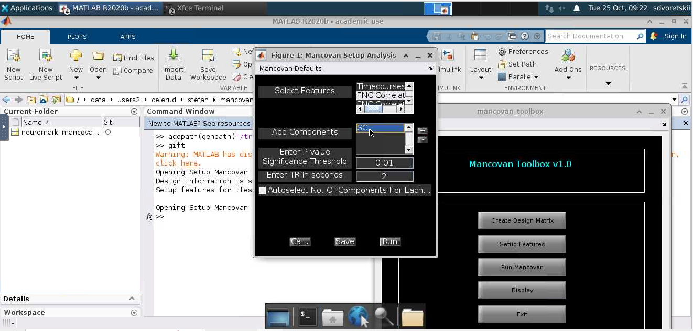

We are free to change the P-Value threshold and TR accordingly. To define Number of components for each vector manually, proceed as following:
first, tick "Autoselect No. of components..." 

Then, untick "Autoselect No. of components...". An input frame appears. Enter the default number of components. 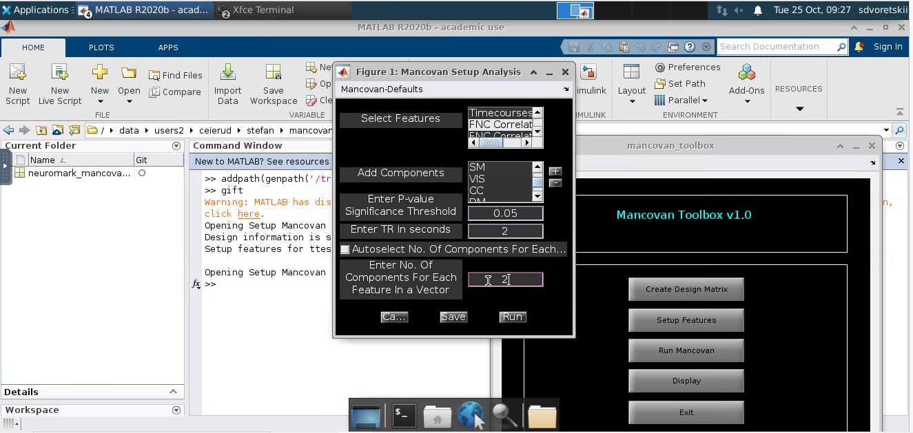

Click "Run" in the bottom of the window. MANCOVAN loads subjects. 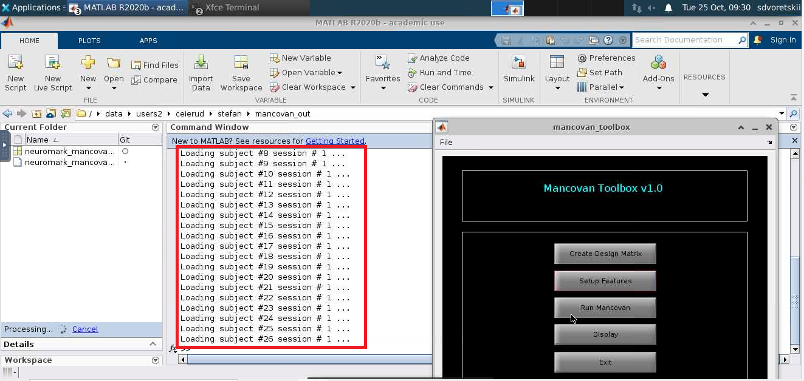

When loading is complete, we are ready to run MANCOVAN. 
Press "Run MANCOVAN" in the main menu. We do not want to remove nuisance covariates. 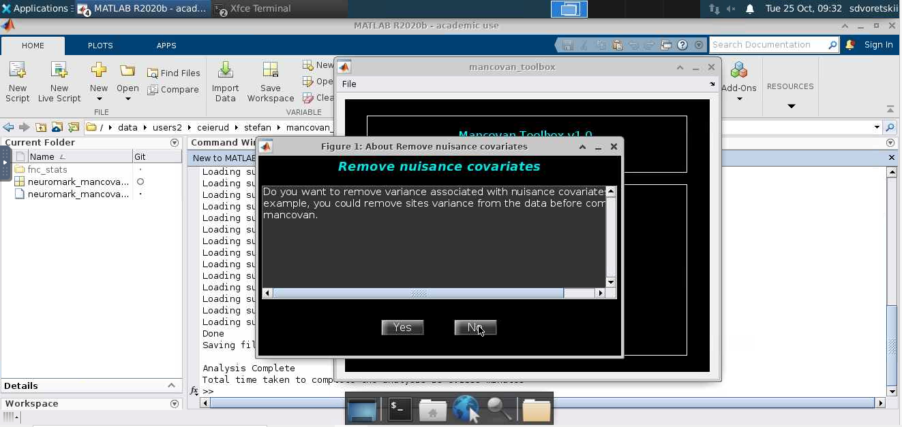

Select MANCOVAN parameter file as done previously (in the projected MANCOVAN output directory). MANCOVAN prints the output
to the MATLAB console. 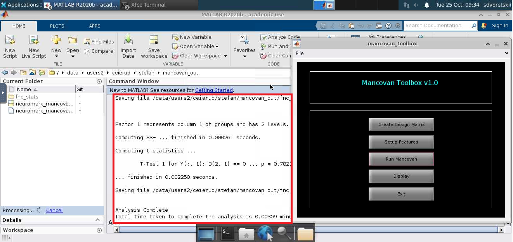

After MATLAB ceases to display "Processing..." marker in the left bottom part, we can display the results. 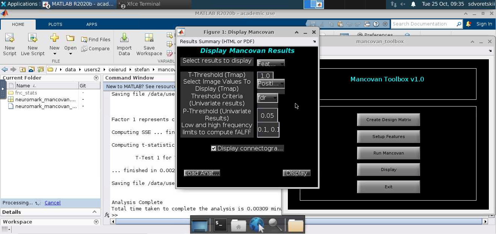

Display univariate results. 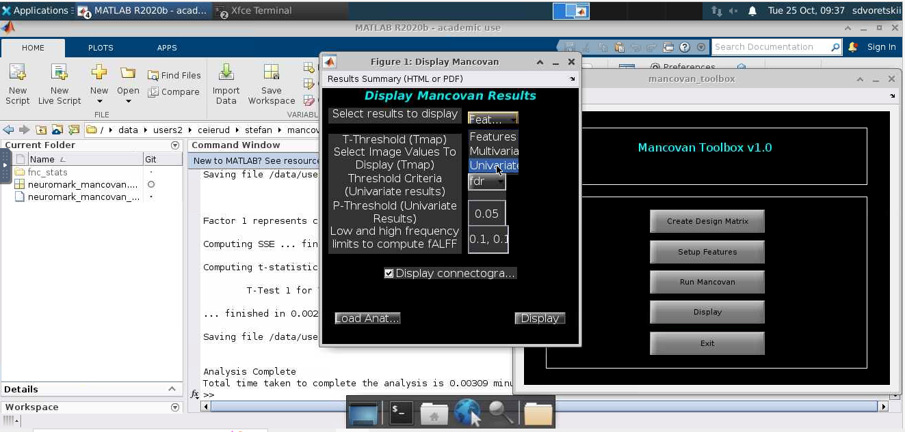
Define T-Threshold to be 1.0, positive and negative image values. We will not do any multiple test correction leave fALFF defaults and display the connectogram. 

Connectogram appears. We see some significant differences in the functional connectivities between components. 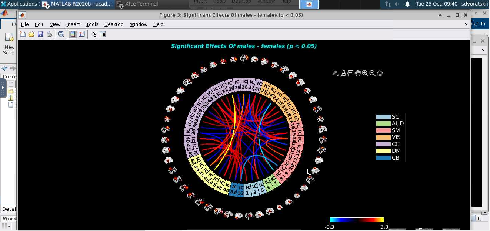

Another figure gives a hint on how significantly different components pairs differ from each other, plotted on a heatmap.


The final figure hints on which components from manually defined have different connectivity across groups. It looks 
like in our setup, Default Mode network and Cognitive-Control network might have significantly different functional 
connectivity patterns across groups. 


# **Conclusion** <a name="secConc"></a>

We are happy if GIFT-BIDS and adjacent toolboxes can deem helpful in your work. Hopefully, this demo made you step closer to utilizing GIFT in your analyses, thus reducing computational burden and processing time.


# References <a name="secRef"></a>

1.  Du, Y., Fu, Z., Sui, J., Gao, S., Xing, Y., Lin, D., ... & Alzheimer's Disease Neuroimaging Initiative. (2020). NeuroMark: An automated and adaptive ICA based pipeline to identify reproducible fMRI markers of brain disorders. _NeuroImage: Clinical_, _28_, 102375.

2.  Esteban, O., Markiewicz, C. J., Blair, R. W., Moodie, C. A., Isik, A. I., Erramuzpe, A., ... & Gorgolewski, K. J. (2019). fMRIPrep: a robust preprocessing pipeline for functional MRI. _Nature methods_, _16_(1), 111-116.

3.  https://fmriprep.org/en/1.5.1/index.html
