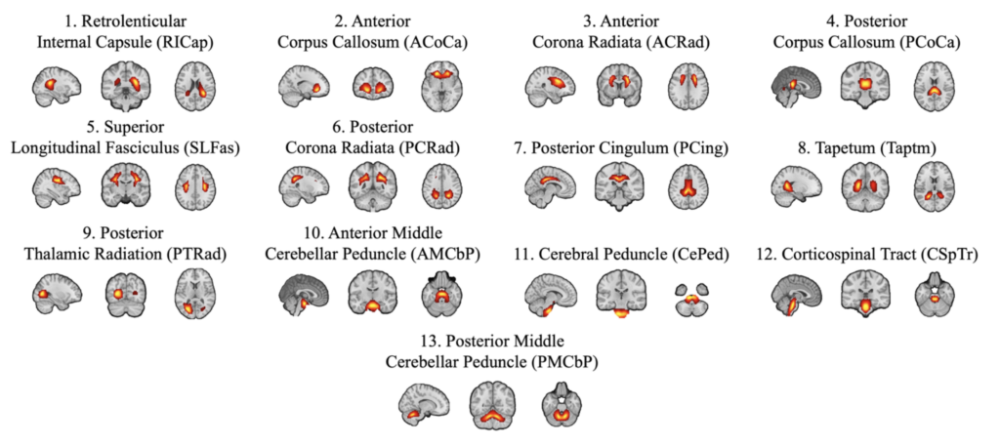
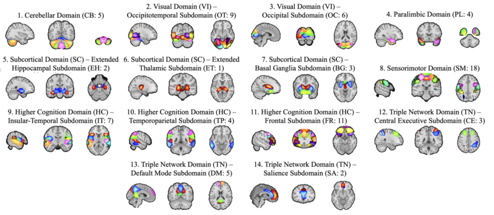

### The Neuromark PET WM-GM template, released March, 2026, is provided for the florbetapir radioligand:

#### A White and Gray Matter (WMGM) florbetapir PET Intrinsic connectivity Network (ICN) template with a model order of 100 can be downloaded using the following files:
ICNs: [Neuromark_PET-FBP_WMGM_2.0_modelorder-100_3x3x3.nii.gz, network template](https://github.com/trendscenter/gift/raw/master/GroupICAT/icatb/icatb_templates/Neuromark_PET-FBP_WMGM_2.0_modelorder-100_3x3x3.nii.gz). 
ICNs labels: [Neuromark_PET-FBP_WMGM_2.0_modelorder-100_3x3x3.txt, network labels](https://github.com/trendscenter/gift/raw/master/GroupICAT/icatb/icatb_templates/Neuromark_PET-FBP_WMGM_2.0_modelorder-100_3x3x3.txt). 
#### All included components are non-artifactual. The figure below depicts the white matter components. 

. 

#### The figure below depicts the gray matter components. 
. 

#### Reference:
Khasayeva, N., Jensen, K. M., Eierud, C., Petropoulos, H., Levey, A. I., Lah, J., … & Iraji, A. (2025). PET-derived amyloid patterns in gray and white matter across the Alzheimer’s disease: A high-model-order ICA. [bioRxiv, 2025-03.](https://www.biorxiv.org/content/10.1101/2025.03.21.644614v3.full.pdf)

