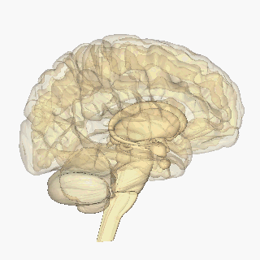

## NeuroMark Template For [TReNDS Center](https://trendscenter.org/) implemented under GIFT Toolbox
<!--  -->
------------------------------------------------------------
NeuroMark Template
- Functional Magnetic Resonance Imaging (MRI)
    - Single-scale
        - Gray Matter (GM)
            - <a href="https://github.com/MahShidF/gift/blob/master/doc/wiki/neuromark/functionalMRI/Neuromark_fMRI_1.0.md">Foundational</a>
            - <a href="https://github.com/MahShidF/gift/blob/master/doc/wiki/neuromark/functionalMRI/Neuromark_fMRI_2.0_modelorder-25.md">Low-order</a>
            - <a href="https://github.com/MahShidF/gift/blob/master/doc/wiki/neuromark/functionalMRI/Neuromark_fMRI_2.0_modelorder-175.md">High-order</a> 
            - <a href="https://github.com/MahShidF/gift/blob/master/doc/wiki/neuromark/functionalMRI/Neuromark_fMRI_2.2_modelorder-500.md">Ultra-high-order</a>
    - Multi-scale
        - <a href="https://github.com/MahShidF/gift/tree/master/doc/wiki/neuromark/functionalMRI/Neuromark_fMRI_2.2_modelorder_multi.md">Gray Matter</a>
            - <a href="https://github.com/MahShidF/gift/tree/master/doc/wiki/neuromark/functionalMRI/Neuromark_Template_2.2_fMRI_SZ.md">Disease-specific</a>
        - <a href="https://github.com/MahShidF/gift/blob/master/doc/wiki/neuromark/functionalMRI/Neuromark_fMRI_WM_2.2_modelorder-multi.md">White Matter (WM)</a>
        - <a href="https://github.com/MahShidF/gift/blob/master/doc/wiki/neuromark/functionalMRI/Neuromark_fMRI_WMGM_2.2_modelorder-multi.md">White Matter + Gray Matter</a> 
    - Developmental
        - Gray Matter
            - <a href="https://github.com/MahShidF/gift/blob/master/doc/wiki/neuromark/functionalMRI/Neuromark_fMRI_3.0_infant_modelorder-100.md">Infants</a>
            - <a href="https://github.com/MahShidF/gift/blob/master/doc/wiki/neuromark/functionalMRI/Neuromark_fMRI_3.0_development_modelorder-100.md">Children</a> 
            - <a href="https://github.com/MahShidF/gift/blob/master/doc/wiki/neuromark/functionalMRI/Neuromark_fMRI_3.0_aging_modelorder-100.md">Aging-adults</a>
    - <a href="https://github.com/MahShidF/gift/blob/master/doc/wiki/neuromark/functionalMRI/RSN_28.md">Resting State Data (Legacy)</a>  
- Positron Emission Tomography (PET)
    - Single-scale
        - Gray Matter 
            - <a href="https://github.com/MahShidF/gift/blob/master/doc/wiki/neuromark/PET/Neuromark_PET-FBP_1.0_modelorder-40_2x2x2.md">Low-order</a>
        - White Matter + Gray Matter
            - <a href="https://github.com/MahShidF/gift/blob/master/doc/wiki/neuromark/PET/Neuromark_PET-FBP_WMGM_2.0_modelorder-100_3x3x3.md">High-order</a>
- Single-Photon Emission Computed Tomography (SPECT)
    - Single-scale 
        - Gray Matter
            - <a href="https://github.com/MahShidF/gift/blob/master/doc/wiki/neuromark/SPECT/Neuromark_SPECT-TC99_1.0.md">Low-order</a> 
- Structural MRI
    - Single-scale
        - Gray Matter
            - <a href="https://github.com/MahShidF/gift/blob/master/doc/wiki/neuromark/StructuralMRI/Neuromark_sMRI_1.0_modelorder-30_2x2x2.md">Low-order</a>  
            - <a href="https://github.com/MahShidF/gift/blob/master/doc/wiki/neuromark/StructuralMRI/Neuromark_sMRI_3.0_modelorder-100_3x3x3.md">High-order</a>  
- Diffusion MRI
    - Single-scale 
        - White Matter
            - <a href="https://github.com/MahShidF/gift/blob/master/doc/wiki/neuromark/diffusionMRI/Neuromark_dMRI_3.0_modelorder-100_3x3x3.md">High-order</a>
-------------------------------------------------------------------------------------------------------------  

<!-- <pre> -->
<!-- NeuroMark Template -->
<!-- ├── functionalMRI -->
<!-- │   ├── GM -->
<!-- │   │   ├── Single-scale -->
<!-- │   │   │   ├── <a href="https://github.com/MahShidF/gift/blob/master/doc/wiki/neuromark/functionalMRI/Neuromark_fMRI_1.0.md">Foundational</a> -->
<!-- │   │   │   ├── <a href="https://github.com/MahShidF/gift/blob/master/doc/wiki/neuromark/functionalMRI/Neuromark_fMRI_2.0_modelorder-25.md">Low-order</a> -->
<!-- │   │   │   ├── <a href="https://github.com/MahShidF/gift/blob/master/doc/wiki/neuromark/functionalMRI/Neuromark_fMRI_2.0_modelorder-175.md">High-order</a> --> 
<!-- │   │       └── <a href="https://github.com/MahShidF/gift/blob/master/doc/wiki/neuromark/functionalMRI/Neuromark_fMRI_2.2_modelorder-500.md">Ultra-high-order</a> -->
<!-- │   │   ├── <a href="https://github.com/MahShidF/gift/tree/master/doc/wiki/neuromark/functionalMRI/Neuromark_fMRI_2.2_modelorder_multi.md">Multi-scale</a> -->
<!-- │   │       └── <a href="https://github.com/MahShidF/gift/tree/master/doc/wiki/neuromark/functionalMRI/Neuromark_Template_2.2_fMRI_SZ.md">Disease-specific</a> -->
<!-- │   │   └── Developmental -->
<!-- │   │   │   ├── <a href="https://github.com/MahShidF/gift/blob/master/doc/wiki/neuromark/functionalMRI/Neuromark_fMRI_3.0_infant_modelorder-100.md">Infants</a> -->
<!-- │   │   │   ├── <a href="https://github.com/MahShidF/gift/blob/master/doc/wiki/neuromark/functionalMRI/Neuromark_fMRI_3.0_development_modelorder-100.md">Children</a>  -->
<!-- │   │       └── <a href="https://github.com/MahShidF/gift/blob/master/doc/wiki/neuromark/functionalMRI/Neuromark_fMRI_3.0_aging_modelorder-100.md">Aging-adults</a> -->
<!-- │   ├── <a href="https://github.com/MahShidF/gift/blob/master/doc/wiki/neuromark/functionalMRI/Neuromark_fMRI_WM_2.2_modelorder-multi.md">WM</a> -->
<!-- │   └── <a href="https://github.com/MahShidF/gift/blob/master/doc/wiki/neuromark/functionalMRI/Neuromark_fMRI_WMGM_2.2_modelorder-multi.md">WM+GM</a> -->
<!-- │   └── <a href="https://github.com/MahShidF/gift/blob/master/doc/wiki/neuromark/functionalMRI/RSN_28.md">Resting State Data (Legacy)</a>  -->
<!-- ├── PET -->
<!-- │   ├── <a href="https://github.com/MahShidF/gift/blob/master/doc/wiki/neuromark/PET/Neuromark_PET-FBP_1.0_modelorder-40_2x2x2.md">GM</a>  -->
<!-- │   └── <a href="https://github.com/MahShidF/gift/blob/master/doc/wiki/neuromark/PET/Neuromark_PET-FBP_WMGM_2.0_modelorder-100_3x3x3.md">WM+GM</a> -->
<!-- ├── SPECT -->
<!-- │   └── <a href="https://github.com/MahShidF/gift/blob/master/doc/wiki/neuromark/SPECT/Neuromark_SPECT-TC99_1.0.md">GM</a>  -->
<!-- ├── StructuralMRI -->
<!-- │   └── GM -->
<!-- │       └── <a href="https://github.com/MahShidF/gift/blob/master/doc/wiki/neuromark/StructuralMRI/Neuromark_sMRI_3.0_modelorder-100_3x3x3.md">High-order</a>  --> 
<!-- └── diffusionMRI  -->
<!-- │   └── WM -->
<!-- │       └── <a href="https://github.com/MahShidF/gift/blob/master/doc/wiki/neuromark/diffusionMRI/Neuromark_dMRI_3.0_modelorder-100_3x3x3.md">High-order</a> -->
<!-- -------------------------------------------------------------------------------------------------------------  -->
<!-- </pre>  -->
