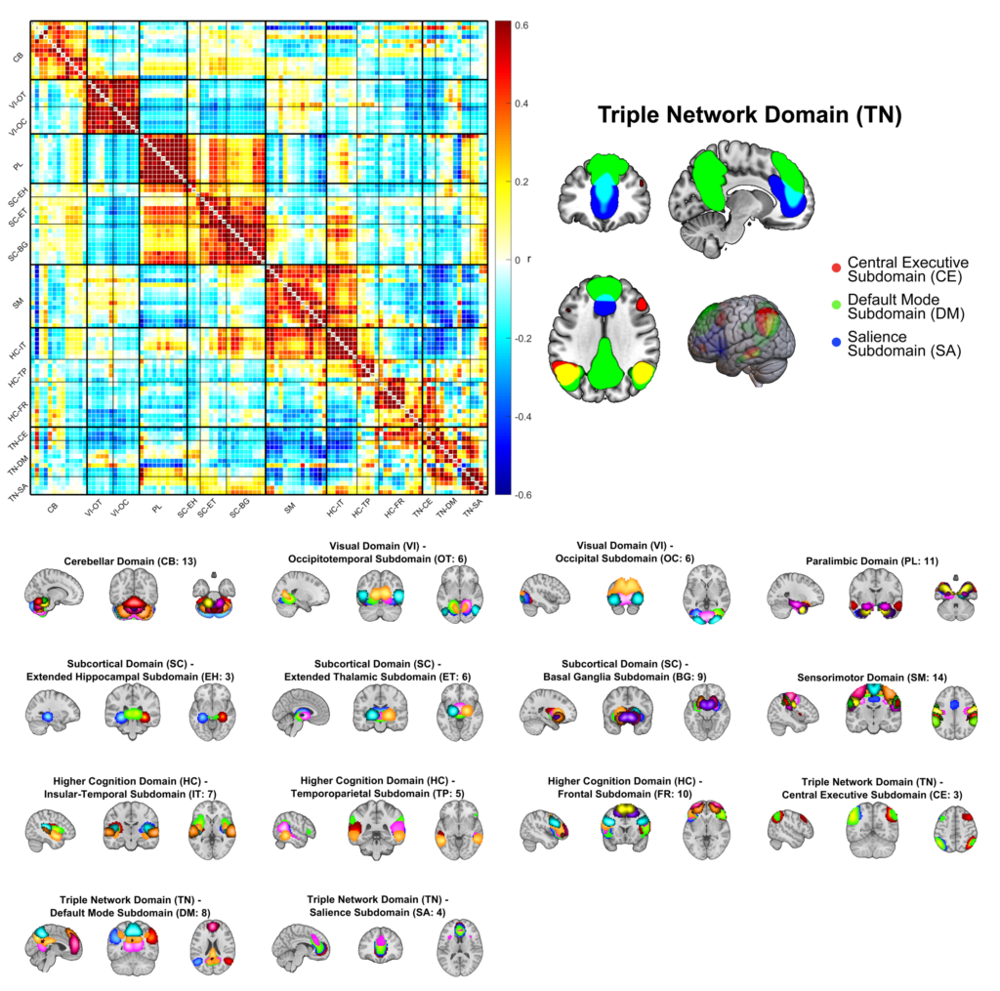

### Optimized Multi-scale fMRI Neuromark 2.2 Template derived from very large data (N~100K) released September, 2024:

A resorted multi-scale order Intrinsic Connectivity Network (ICN) template, created from 25, 50, 75, 100, 125, 150, 175, 200 components, yielding 105 non-artifactual and overlapping networks and can be downloaded by clicking following link, [Neuromark_fMRI_2.2_modelorder-multi.nii](https://github.com/trendscenter/gift/raw/master/GroupICAT/icatb/icatb_templates/Neuromark_fMRI_2.2_modelorder-multi.nii), including the label file [Neuromark_fMRI_2.2_modelorder-multi.txt](https://github.com/trendscenter/gift/raw/master/GroupICAT/icatb/icatb_templates/Neuromark_fMRI_2.2_modelorder-multi.txt).  

#### Link showing how to run this Neuromark Template is [here](https://github.com/trendscenter/gift/blob/master/doc/web/updates/9858_2-13-26_NeuroMark_fMRI_2.2_script_v4.0.6.31.md). 

#### Reference:

1- [K. Jensen, J. A. Turner, V. D. Calhoun, A. Iraji. “Addressing inconsistency in functional neuroimaging: A replicable data-driven multi-scale functional atlas for canonical brain networks”, bioRxiv, 2024](https://www.biorxiv.org/content/10.1101/2024.09.09.612129v1). 
2- [A. Iraji, Z. Fu, A. Faghiri, M. Duda, J. Chen, S. Rachakonda, T. DeRamus, P. Kochunov et. al. “Identifying canonical and replicable multi-scale intrinsic connectivity networks in 100k+ resting-state fMRI datasets”, Human brain mapping, 2023, https://doi.org/10.1002/hbm.26472](https://www.biorxiv.org/content/10.1101/2024.09.09.612129v1). 
Supplementals downloadable by clicking [here](https://trendscenter.org/trends/data/neuromark/Supp2022Iraji.zip)

